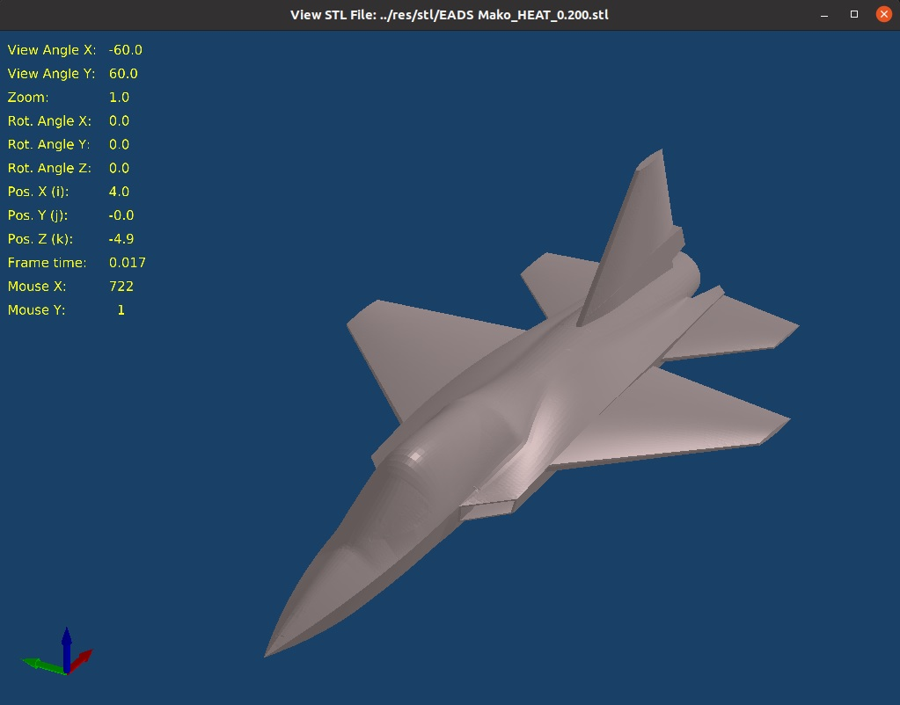

## C++ Capstone Project – OpenGL STL File Viewer

 

 

### Project Description and Usage Notes

This “Option 1” Capstone project opens an OpenGL window and displays a 3D rendering of an object defined in one of several ASCII “.stl” (<u>ST</u>ereo-<u>L</u>ithography) files that are available in the resource folder (/res/meshes). Several values related to the view (zoom level, view angles, model rotations and positions, frame refresh time, mouse position) are displayed in the upper left portion of the window. The view can be adjusted by the user by holding down certain keys while clicking and dragging the mouse left and right within the OpenGL window, as noted below:

 

- Mouse drag - Adjust view angles
- Mouse drag + Shift - Adjust zoom level
- Mouse drag + Ctrl - X & Y pan
- Mouse drag + X - Adjust rotation of model about its own X-Axis
- Mouse drag + Y - Adjust rotation of model about its own Y-Axis
- Mouse drag + Z - Adjust rotation of model about its own Z-Axis
- Mouse drag + I - Move model along its own rotated X-Axis
- Mouse drag + J - Move model along its own rotated Y-Axis
- Mouse drag + K - Move model along its own rotated Z-Axis
- M - Toggle view of model mesh lines
- O - Return View to Default

### Dependencies for Running Locally

- Cmake – Same as other CppND starter repos
- make – Same as other CppND starter repos
- gcc/g++ – Same as other CppND starter repos
- GLFW
  - Linux – in a terminal window: sudo apt-get install libglfw3-dev
- Other libraries (freetype, glad, glm, khr and stb) have been compiled, if needed, for Linux and the required files are present in the repository.

 

### Basic Build Instructions

1. Clone this repo.
2. Make a build directory in the top-level directory:  mkdir build && cd build
3. Compile: cmake .. && make
4. Run it: ./cpp_ogl

 

### File and Class Structure

The OpenGL implementation in this program was inspired and guided by content in the book "Learn OpenGL" by Joey de Vries, also available at https://learnopengl.com/. The file and class structure are listed below.

- Header Files (in the /include/ folder)
  - camera.h
    - Camera class – controls the point of view of the OpenGL window
  - oglwindow.h
    - OGLObject class – object that consists of the shape from an .stl file as well as material properties and the location/orientation of the object. This class also contains indices for the vertex array and the vertex buffer which are sent to the GPU.
    - Material class – contains color and transparency properties of an object.
    - OGLWindow class – controls the overall creation and manipulation of the OpenGL window.
      - GLFWCallbackWrapper nested class – handles callback functions that enable user input via the keyboard and mouse.
  - shader.h
    - Shader class - declares and implements the reading and compilation of “GLSL” files (located in the /res/shaders folder). This header is a thinned-out version of the same file in the book “Learn OpenGL” (1. support for geometry shaders was removed and; 2. class constructor was repurposed as RetrieveAndCompile function).
  - shape.h
    - Facet class - 3 points in 3D space and a normal vector for the facet (this could have been a struct)
    - Shape class – contains the data for all the facets in the model and methods to read the data in from an “.stl” file
  - Third Party headers
    - freetype (https://freetype.org/) - including ft2build.h, freetype is a software development library that is able to load fonts, render them to bitmaps, and provide support for several font-related operations
    - glad (https://github.com/Dav1dde/glad) - retrieves location of OS-specific OpenGL functions and stores them in function pointers
    - GLFW (https://www.glfw.org/) - provides a simple API for creating windows, contexts and surfaces, receiving input and events
    - glm (https://glm.g-truc.net/0.9.8/index.html) - a header only C++ mathematics library for graphics software based on the OpenGL Shading Language (GLSL) specifications.
    - KHR (https://www.khronos.org/registry/EGL/api/KHR/khrplatform.h)
    - stb (https://github.com/nothings/stb/blob/master/stb_image.h) - image loading library by Sean Barrett
- Libraries
  - libglfw3.a - part of the GLFW package
- Resource files (in the /res/ folder)
  - fonts - TrueType fonts to be used by freetype
  - shaders - vertex and fragment shader files in GLSL
  - stl - several “.stl” (<u>ST</u>ereo-<u>L</u>ithography) files defining shapes.  The two files depicting a fighter jet at different levels of mesh refinement were meshed from a CAD file downloaded from:  https://grabcad.com/library/eads-mako-heat-1
- Source Files
  - camera.cpp – implements the Camera class which is primarily the “UpdateCameraVectors” method which updates vectors that define the point of view based on user input.
  - glad.c – recommended by glad.h to be in the source folder of the project
  - main.cpp – implements int main() and methods to facilitate initial user selections
  - oglwindow.cpp - this file implements the OGLWindow class, which initiates and controls the OpenGL window.  This class sends vertex information, gathered from the ".stl" file, to the GPU; runs the double buffered rendering loop; and accepts user input from the mouse and keyboard 
  - shape.cpp - reads the ASCII ".stl" file (this program will not read a binary stl file) and loads it into a Shape object
- Other files
  - Capstone Readme.md - this file
  - CMakeLists.txt - CMake file
  - Makefile - Make file
  - screenshot.jpg - image shown at top of this Readme file

 

### Rubric Criteria

- Loops, Functions, I/O
  - C++ functions and control structures
    - Variety of control structures used – **criteria 1a met**
      - while loop – main.cpp, line 37
      - range based for loop – main.cpp, line 55
      - if statement – oglwindow.cpp, lines 25, 39, etc…
      - while loop - oglwindow.cpp, line 52
      - for loop with index variable - oglwindow.cpp, lines 79, 83, 87, etc…
      - switch statement - oglwindow.cpp, line 621
    - Code organized into functions – **criteria 1b met**
      - Function declarations
        - camera.h, lines 24 – 29
        - oglwindow.h, lines 112 – 126
        - shape.h, lines 45 - 49
  - Reads/processes from, or writes to a file – **criteria 2 met**
    - Reads/processes from file
      - shape.cpp, lines 18-92
  - Accepts/processes user input – **criteria 3 met**
    - Keyboard input
      - main.cpp – line 34, 40
      - oglwindow.cpp – line 568, 602, 617
- Object Oriented Programming
  - Uses Object Oriented Programming techniques – **criteria to be judged by mentor**
    - Multiple classes used throughout project
  - Classes use appropriate access specifiers for members – **criteria 4 met**
    - Classes that use access specifiers
      - Camera, camera.h - public: line 10, private: line 34
      - OGLObject, oglwindow.h – public: line 21
      - Material, oglwindow.h – public: line 50
      - OGLWindow, oglwindow.h – public: line 81, private: line 128
      - Shape, shape.h – public: line 35
  - Class constructors utilize member initialization lists – **criteria 5 met**
    - Classes that use member initialization lists
      - Camera, camera.h – Constructor on line 12
      - OGLObject, oglwindow.h – Constructor on line 23
      - Material, oglwindow.h – Constructor on line 52
      - OGLWindow, oglwindow.h – Constructor on line 82
      - Shape, shape.h – Constructor on line 37
  - Classes abstract implementation details from their interfaces - **criteria to be judged by mentor**
    - Classes encapsulate behavior
      - Appropriate data and functions are grouped into classes.
      - Member data that is subject to an invariant is hidden from the user.
      - State is accessed via member functions.
  - Classes follow an appropriate inheritance hierarchy - **N/A**
  - Overloaded functions allow the same function to operate on different parameters - **N/A**
  - Derived class functions override virtual base class functions - **N/A**
  - Templates generalize functions in the project - **N/A**
- Memory Management
  - Makes use of references in function declarations – **criteria 6 met**
    - Function declarations using references
      - oglwindow.h - SetProjectionAndView, line 116
      - oglwindow.h - InitVertices, line 119
      - oglwindow.h - ApplyMatlToShader, line 123
  - Uses destructors appropriately - **N/A**
  - Uses scope / Resource Acquisition Is Initialization (RAII) where appropriate – **criteria 7 met**
    - Large Shape objects ()"triadArrow" and "surfaceMesh") go out of scope at end of OGLWindow::SendVerticesToGPU method on line 171
  - Follows the Rule of 5 - **N/A**
  - Uses move semantics to move data, instead of copying it, where possible – **criteria 8 met**
    - Move semantics used in lines:
      - main.cpp:73
      - oglwindow.cpp:150
      - oglwindow.cpp:154
  - Uses smart pointers instead of raw pointers – **criteria 9 met**
    - Smart pointers declared in lines
      - main.cpp:70
      - oglwindow.cpp:148
- Concurrency
  - Uses multithreading - **N/A**
  - A promise and future is used in the project - **N/A**
  - A mutex or lock is used in the project - **N/A**
  - A condition variable is used in the project - **N/A**